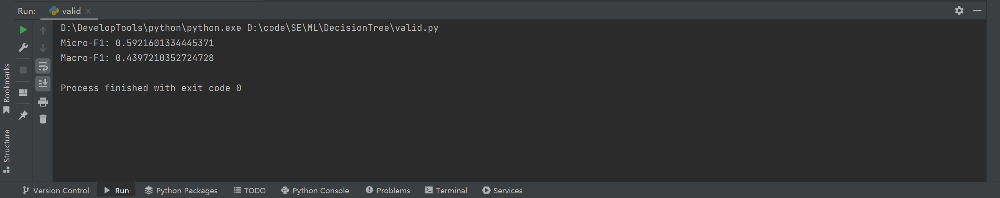

# Python决策树作业实验报告

> 2023/4/1 
>

## 目录结构

```shell
.
├── README.md
├── README.pdf # 实验报告
├── __pycache__
│   ├── decision_tree.cpython-310.pyc
│   └── draw_tree.cpython-310.pyc
├── assets
│   ├── image-20230401125339696.png
│   └── image-20230401130138429.png
├── decision_tree.py # 决策树代码
├── draw_tree.py # 模型可视化代码
├── predict.py # 测试集预测代码
├── testing.csv # 测试集
├── testing_process.csv # 测试集预测结果
├── training.csv # 训练集
├── training_process.csv # 训练集处理后文件
├── tree.pickle # 模型的二进制形式
├── valid.py # 预测效果检查
├── validation.csv # 检测集
└── validation_process.csv # 检测集
```


## 实验目的

给定药品数据集构造决策树，并用Micro-F1和Macro-F1分数进行验证集评估，预测测试集中的药品等级。


## 实验内容

- 数据预处理

- 构建决策树划分标准函数
- 创建决策树
- 验证集评估
- 测试集预测


## 实验方法

- 使用pandas对数据进行预处理，去除脏数据。
- 使用ID3算法，根据信息熵选择合适的分类标准，不断迭代，最后产生一个可用的决策树模型。
- 运用模型，通过递归算法预测testing.csv文件。
- 使用pyplot库对得到的模型可视化。


## 实验步骤

### 数据预处理

```python
def drop_columns(csv_file):
    """数据预处理,去除冗余列"""
    df = pd.read_csv(csv_file)
    df = df.drop(['recordId', 'drugName', 'condition', 'reviewComment', 'date'], axis=1)
    new_file = csv_file.replace(".csv", "_process.csv")
    df.to_csv(new_file, index=False, encoding="utf-8")
    return new_file


def drop_dirty_lines(file):
    """数据预处理，去除脏数据"""
    # 读取文件
    with open(file, 'r') as f:
        lines = f.readlines()

    # 删去字符","出现次数不等于2的行
    new_lines = []
    for line in lines:
        if line.count(',') == 2:
            new_lines.append(line)

    # 将结果覆盖原文件
    with open(file, 'w') as f:
        f.writelines(new_lines)
```

### ID3算法

```python
def id3(data):
    """
    ID3算法实现
    """
    # 如果数据集中所有样本属于同一类别，则返回该类别
    if len(data.iloc[:, -1].unique()) == 1:
        return data.iloc[0, -1]

    # 如果数据集中没有特征，则返回出现次数最多的类别
    if data.shape[1] == 1:
        return data.iloc[:, -1].value_counts().idxmax()

    # 计算每个特征的信息增益，并选择信息增益最大的特征作为当前节点的划分标准
    info_gains = {}
    for feature in data.columns[:-1]:
        info_gains[feature] = calc_info_gain(data, feature)
    best_feature = max(info_gains, key=info_gains.get)

    # 根据所选特征的不同取值建立子节点
    tree = {best_feature: {}}
    for value in data[best_feature].unique():
        sub_data = data[data[best_feature] == value].drop(best_feature, axis=1)
        tree[best_feature][value] = id3(sub_data)

    return tree
```

### 计算信息熵

```python
def calc_info_gain(data, feature):
    """
    计算信息熵
    """
    entropy_before = calc_entropy(data)
    entropy_after = 0
    for value in data[feature].unique():
        sub_data = data[data[feature] == value]
        sub_entropy = calc_entropy(sub_data)
        entropy_after += len(sub_data) / len(data) * sub_entropy
    return entropy_before - entropy_after
```

### 保存训练模型

```python
# 保存决策树模型到文件
    with open('tree.pickle', 'wb') as f:
        pickle.dump(tree, f)
```

### 模型可视化

```python
def draw(inTree):
    """显示决策树"""

    # 创建新的图像并清空 - 无横纵坐标
    fig = plt.figure(1, facecolor='white')
    fig.clf()
    axprops = dict(xticks=[], yticks=[])
    draw.ax1 = plt.subplot(111, frameon=False, **axprops)

    # 树的总宽度 高度
    plotTree.totalW = float(get_num_leaves(inTree))
    plotTree.totalD = float(getTreeDepth(inTree))

    # 当前绘制节点的坐标
    plotTree.xOff = -0.5 / plotTree.totalW
    plotTree.yOff = 1.0

    # 绘制决策树
    plotTree(inTree, (0.5, 1.0), '')

    plt.show()
```

### 预测testing.csv

```python
def do_predict():
    """
    预处理文件并调用预测方法
    """
    # 从文件中加载决策树模型
    with open('tree.pickle', 'rb') as f:
        tree = pickle.load(f)

    t = type(tree)

    test_file = 'training.csv'

    new_test_file = drop_columns(test_file)

    drop_dirty_lines(new_test_file)

    # 读取测试集数据
    test_data = pd.read_csv(new_test_file, usecols=[0, 1])

    # 使用决策树模型对测试集进行预测
    predictions = []
    for i in range(len(test_data)):
        data = test_data.iloc[[i]]
        prediction = predict(tree, data)
        predictions.append(prediction)
        test_data.loc[i, 'rating'] = prediction

    test_data.to_csv(new_test_file, index=False)
    
def predict(tree, data):
    """
    使用决策树模型对数据进行预测
    """
    feature = list(tree.keys())[0]
    sub_tree = tree[feature]
    value = data[feature].iloc[0]

    # 处理未知特征值
    if value not in sub_tree:
        return -1

    if isinstance(sub_tree[value], dict):
        return predict(sub_tree[value], data)
    else:
        return sub_tree[value]
```

### 检验validation.csv的预测效果

```python
# 读取csv文件的最后一列
y_true = pd.read_csv('validation.csv').iloc[:, -1]
y_pred = pd.read_csv('validation_process.csv').iloc[:, -1]

# 计算Micro-F1分数
f1 = f1_score(y_true, y_pred, average='micro')
f2 = f1_score(y_true, y_pred, average='macro')


# 打印结果
print(f'Micro-F1: {f1}')
print(f'Macro-F1: {f2}')
```


## 实验结果

### 模型可视化（因为数据量较大，无法清晰显示所有子树）


### 验证集评估结果




## 结论与分析

### 决策树模型

优点：

- 速度快:计算量相对较小，且容易转化成分类规则。只要沿着树根向下一直走到叶，沿途的分裂条件就能够唯一确定一条分类的谓词。
- 准确性高:挖掘出的分类规则准确性高，便于理解，决策树可以清晰的显示哪些字段比较重要。
- 非参数学习，不需要设置参数。

缺点：

- 决策树很容易过拟合，很多时候即使进行后剪枝也无法避免过拟合的问题，因此可以通过设置树深或者叶节点中的样本个数来进行预剪枝控制。
- 决策树属于样本敏感型，即使样本发生一点点改动，也会导致整个树结构的变化，可以通过集成算法来解决。

## 参考文献

1. [ID3](https://en.wikipedia.org/wiki/ID3_algorithm)
2. 《机器学习》周志华