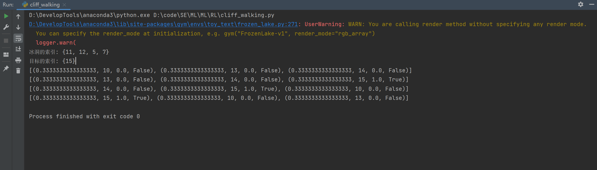
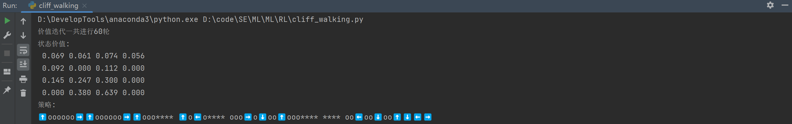

# RL

> 2023春机器学习 小作业 RL
>
> 2023/4/28
>

## 算法原理

### 策略迭代

1. 初始化智能体的状态和环境：智能体初始位置为起点，当前时间为 0，环境为空环境。
2. 定义奖励函数：定义一个奖励函数，用于评估智能体在当前状态下采取的行动。在 Cliff Walking 任务中，奖励函数应该根据智能体是否沿着悬崖边缘行走来评估行动。具体来说，如果智能体沿着悬崖边缘行走，则奖励为 +1，否则奖励为 -1。
3. 计算智能体的期望奖励：智能体根据当前状态和环境计算出期望奖励。具体来说，期望奖励等于智能体在未来一段时间内有可能获得的正向奖励的平均值。可以使用未来奖励的期望作为智能体的目标。
4. 更新智能体的策略：智能体根据当前状态和环境计算出新的策略。具体来说，如果智能体沿着悬崖边缘行走，则新策略为沿着悬崖边缘行走，否则新策略为沿着直线前进。
5. 重复步骤 3-4，直到智能体的策略收敛到最优解。

### 价值迭代

1. 初始化智能体的状态和环境：智能体初始位置为起点，当前时间为 0，环境为空环境。
2. 定义奖励函数：定义一个奖励函数，用于评估智能体在当前状态下采取的行动。在 Cliff Walking 任务中，奖励函数应该根据智能体是否沿着悬崖边缘行走来评估行动。具体来说，如果智能体沿着悬崖边缘行走，则奖励为 +1，否则奖励为 -1。
3. 计算智能体的期望奖励：智能体根据当前状态和环境计算出期望奖励。具体来说，期望奖励等于智能体在未来一段时间内有可能获得的正向奖励的平均值。可以使用未来奖励的期望作为智能体的目标。
4. 更新智能体的价值函数：智能体根据当前状态和环境计算出新的价值函数。具体来说，如果智能体沿着悬崖边缘行走，则新价值函数为当前状态下沿悬崖边缘行走的期望奖励加上一个超参数，否则新价值函数为当前状态下沿直线前进的期望奖励加上一个超参数。
5. 重复步骤 3-4，直到智能体的价值函数收敛到最优解。

## 运行环境

- Python: Python 3.10.10
- Dependencies: copu, gym

## 代码实现

### 悬崖漫步环境设计

在这个环境设计中，我们使用 2D 空间来表示悬崖峭壁，其中 ncol和 nrow分别表示悬崖的宽度和高度。智能体的目标是沿着悬崖边缘行走，而不掉落悬崖。定义智能体具有上、下、左、右方向的动作，

```python
class CliffWalkingEnv(object):
    def __init__(self, ncol=12, nrow=4):
        self.ncol = ncol  # 定义网格世界的列
        self.nrow = nrow  # 定义网格世界的行
        # 转移矩阵 P[state][action] = [(p, next_state, reward, done)]包含下一个状态和奖励
        self.P = self.createP()
    
# 定义环境和参数
env = CliffWalkingEnv()
action_meaning = ['⬆️', '⬇️', '⬅️', '➡️']
theta = 0.001
gamma = 0.9
```

### 策略迭代过程

在每一次策略迭代中，智能体通过计算当前状态下各个动作的 Q 值，来选择最优的动作。具体来说，代码中实现了一个 Q 值列表，用于记录不同动作在不同状态下的 Q 值。智能体遍历所有状态，对于每个状态，它先计算所有可能的动作在该状态下的 Q 值，然后找到最大值，并根据 Q 值的大小来决定采取哪个动作。

在策略迭代算法中，每次迭代都会将之前的策略进行更新，使得策略更加逼近最优解。在更新策略时，代码中使用了一个深拷贝来复制原始策略列表，以避免策略更新时对原始策略列表造成影响。在更新策略后，如果新策略与旧策略相等，则算法结束，否则继续迭代。

```python
class PolicyIteration:
    """策略迭代算法."""
	def policy_improvement(self):  # 策略提升
        for s in range(self.env.nrow * self.env.ncol):
            qsa_list = []
            for a in range(4):
                qsa = 0
                for res in self.env.P[s][a]:
                    p, next_state, r, done = res
                    qsa += p * (r + self.gamma * self.v[next_state] * (1 - done))
                qsa_list.append(qsa)
            maxq = max(qsa_list)
            cntq = qsa_list.count(maxq)  # 计算有几个动作得到了最大的Q值
            # 让这些动作均分概率
            self.pi[s] = [1 / cntq if q == maxq else 0 for q in qsa_list]
        print('策略提升完成')
        return self.pi

    def policy_iteration(self):  # 策略迭代
        while 1:
            self.policy_evaluation()
            old_pi = copy.deepcopy(self.pi)  # 将列表进行深拷贝,方便接下来进行比较
            new_pi = self.policy_improvement()
            if old_pi == new_pi:
                break
```

### 价值迭代过程

在每一次价值迭代中，智能体通过计算不同状态下的 Q 值，来更新状态的价值。具体来说，代码中实现了一个 Q 值列表，用于记录不同状态下不同动作的 Q 值。智能体遍历所有状态，对于每个状态，它先计算所有可能的动作在该状态下的 Q 值，然后找到最大值，并根据 Q 值的大小来决定采取哪个动作。

在价值迭代算法中，每次迭代都会将之前的价值进行更新，使得价值更加逼近最优解。在更新价值时，代码中使用了一个比较器来比较新价值与旧价值的大小，如果新价值比旧价值大，则将新价值赋给旧价值，否则不进行更新。在满足收敛条件时，即新价值与旧价值之间的差异小于超参数 theta，算法结束，并开始执行下一步操作，即获取新策略。

```python
class ValueIteration:
    """ 价值迭代算法 """
    def value_iteration(self):
        cnt = 0
        while 1:
            max_diff = 0
            new_v = [0] * self.env.ncol * self.env.nrow
            for s in range(self.env.ncol * self.env.nrow):
                qsa_list = []  # 开始计算状态s下的所有Q(s,a)价值
                for a in range(4):
                    qsa = 0
                    for res in self.env.P[s][a]:
                        p, next_state, r, done = res
                        qsa += p * (r + self.gamma * self.v[next_state] *
                                    (1 - done))
                        qsa_list.append(qsa)  # 这一行和下一行是价值迭代和策略迭代的主要区别
                        new_v[s] = max(qsa_list)
                        max_diff = max(max_diff, abs(new_v[s] - self.v[s]))
                        self.v = new_v
                        if max_diff < self.theta: break  # 满足收敛条件,退出评估迭代
                            cnt += 1
                            print("价值迭代一共进行%d轮" % cnt)
                            self.get_policy()
```


## 运行结果

### 策略评估


### 价值迭代


### 冰湖环境



### 冰湖-策略评估


### 冰湖-价值迭代

