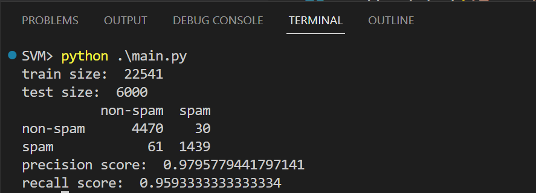
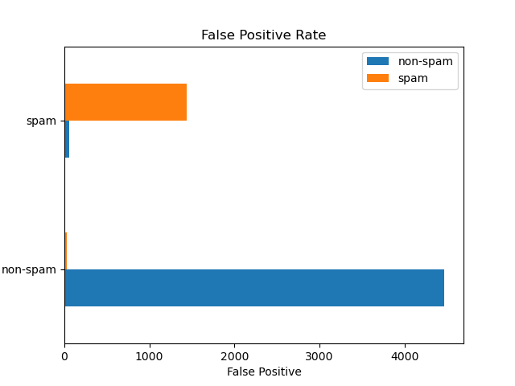

# SVM

> 2023春机器学习 小作业 SVM
>
> 2023/4/24
>

## 算法原理

支持向量机 (SVM) 是一种常用的机器学习算法，其基本原理是通过找到一个最优的超平面来将数据集中的样本分成不同的类别。

在 SVM 中，数据被表示为一个高维空间中的向量，然后通过找到一个最优的超平面来将数据集中的样本分成不同的类别。这个最优的超平面可以表示为一个间隔最大的边界，它将数据集中的两类样本分开。

具体实现中，SVM 使用一个支持向量机函数来评估样本之间的距离，然后使用这个函数来找到一个最优的超平面。这个支持向量机函数通常是一个二次函数，它可以将数据集中的两类样本分开。当给定一个新的样本时，SVM 会计算它与数据集中所有已知样本之间的距离，然后根据这些距离计算一个分类决策。


## 算法流程

1. 准备数据集：将数据集分为训练集和测试集，并准备相应的数据。
2. 划分超平面：使用 SVM 函数计算数据集中两类样本之间的距离，并找到一个最优的超平面。
3. 训练 SVM 模型：使用训练集训练 SVM 模型，并根据训练结果调整模型参数。
4. 测试 SVM 模型：使用测试集测试 SVM 模型的分类准确性。
5. 分类预测：使用 SVM 模型对新的样本进行分类预测。


## 运行环境

- Python: Python 3.10.10
- Dependencies: numpy, pandas, os, sklearn


## 代码实现

1. 读入数据

   ```python
   def extract_text(mail_dir):
       """
       load data from local and extract text
       """
       files = []
       labels = []
       for dir in os.listdir(mail_dir):
           subdir = os.path.join(mail_dir, dir)
           if os.path.isdir(subdir):
               for sub_sub_dir in os.listdir(subdir):
                   if sub_sub_dir == "ham":
                       for fi in os.listdir(os.path.join(subdir, "ham")):
                           files += [os.path.join(subdir, "ham", fi)]
                           labels.append(1)
                   elif sub_sub_dir == "spam":
                       for fi in os.listdir(os.path.join(subdir, "spam")):
                           files += [os.path.join(subdir, "spam", fi)]
                           labels.append(0)
       test_matrix = np.ndarray((len(files)), dtype=object)
       id = 0
       for fil in files:
           with open(fil, 'r', errors="ignore") as fi:
               next(fi)
               data = fi.read().replace('\n', ' ')
               test_matrix[id] = data
               id += 1
       return test_matrix, labels
   ```

2. 特征提取

   ```python
   train_dir = "./data/train"
   train_matrix, train_labels = extract_text(train_dir)
   print("train size: ", train_matrix.shape[0])
   
   count_v1 = CountVectorizer(stop_words="english", max_df=0.5, decode_error="ignore", binary=True)
   counts_train = count_v1.fit_transform(train_matrix)
   tf_idf_transformer = TfidfTransformer()
   tfidf_train = tf_idf_transformer.fit(counts_train).transform(counts_train)
   ```
   
2. 训练分类器

   ```python
   model = LinearSVC()
   model.fit(tfidf_train, train_labels)
   ```
   
4. 测试和评估

   ```python
   # test
   test_dir = "./data/test"
   test_matrix, test_labels = extract_text(test_dir)
   print("test size: ", test_matrix.shape[0])
   
   count_v2 = CountVectorizer(vocabulary=count_v1.vocabulary_, stop_words="english", max_df=0.5, decode_error="ignore", binary=True)
   counts_test = count_v2.fit_transform(test_matrix)
   tfidf_test = tf_idf_transformer.fit(counts_test).transform(counts_test)
   
   result = model.predict(tfidf_test)
   cm = pd.DataFrame(
       confusion_matrix(test_labels, result), index=["non-spam", "spam"], columns=["non-spam", "spam"]
   )
   
   # 混淆矩阵
   print(cm)
   
   # 精度和召回率  
   print("precision score: ", precision_score(test_labels, result))
   print("recall score: ", recall_score(test_labels, result))
   ```

5. 可视化

   ```python
   # 绘制混淆矩阵 
   cm.plot(kind='barh')  
   plt.xlabel('True Label')  
   plt.ylabel('Predicted Label')  
   plt.title('Confusion Matrix')  
   plt.show()
   
   # 绘制直方图
   cm.plot(kind='barh')  
   plt.xlabel('False Positive')  
   plt.ylabel('True Positive')  
   plt.title('False Positive Rate')  
   plt.show()
   ```


## 运行结果

### 精确率和召回率

- 精确率：0.9795779441797141
- 召回率：0.9593333333333334



### 混淆矩阵


### 直方图

