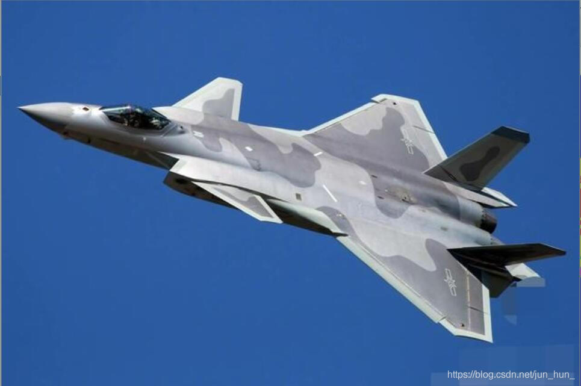
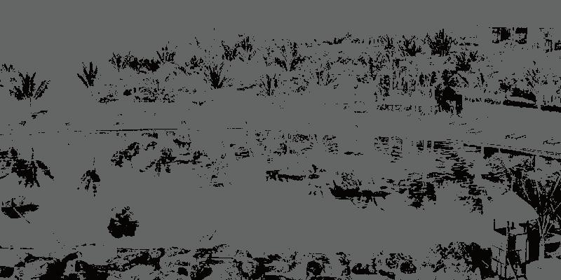

# K-means聚类

> 2023春机器学习 小作业1
>
> 2023/3/9

## 算法原理

K-means算法是一种典型的基于划分的聚类算法,该算法具有运算速度快，执行过程简单的优点，在很多大数据处理领域得到了广泛的应用。利用相似性度量方法来衡量数据集中所有数据之间的关系，将关系比较密切的数据划分到一个集合中。


## 算法流程

1. K-means算法首先需要选择K个初始化聚类中心。
2. 计算每个数据对象到K个初始化聚类中心的距离，将数据对象分到距离聚类中心最近的那个数据集中，当所有数据对象都划分以后，就形成了K个数据集（即K个簇）
3. 接下来重新计算每个簇的数据对象的均值，将均值作为新的聚类中心
4. 最后计算每个数据对象到新的K个初始化聚类中心的距离，重新划分
5. 每次划分以后，都需要重新计算初始化聚类中心，一直重复这个过程，直到所有的数据对象无法更新到其他的数据集中。


## 运行环境

- IDE: Pycharm for windows
- Python: Python 3.10.10
- Dependencies: numpy, cv2, os, random

 

## 代码实现

1. 预处理（缩放图片，防止图片过大导致时间太长无法接受）

   ```python
   image = cv2.imread(file)
   size = 1600  # 缩放后的大小
   height, width = image.shape[0], image.shape[1]
   scale = height / size # 等比例缩放
   width_size = int(width / scale)
   
   image_resize = cv2.resize(image, (width_size, size))
   cv2.imwrite(file + "_process.jpg", image_resize)
   ```

2. 初始化聚类

   ```python
   # 随机选择一个样本作为聚类中心
       index = np.random.randint(0, m)
       cluster_centers[0,] = np.copy(points[index,])
       
       # 初始化一个距离的序列
       d = [0.0 for _ in range(m)]
   
       for i in range(1, k):
           sum_all = 0
       
           for j in range(m):
               # 对每一个样本找到最近的聚类中心点
               d[j] = nearest(points[j,], cluster_centers[0:i, ])
               # 将所有的最短距离相加
               sum_all += d[j]
       
           # 取得sum_all之间的随机值
           sum_all *= random()
       
           # 获得距离最远的样本点作为聚类中心点
           for j, di in enumerate(d):
               sum_all -= di
               if sum_all > 0:
                   continue
               cluster_centers[i] = np.copy(points[j,])
               break
   ```

3. 聚类

   ```python
    change = True  # 判断是否需要重新计算聚类中心
       while change:
           change = False  # 重置
   
           for i in range(m):
               minDist = np.inf  # 设置样本与聚类中心之间的最小的距离，初始值为争取穷
               minIndex = 0  # 所属的类别
   
               for j in range(k):
                   # 计算i和每个聚类中心之间的距离
                   dist = distance(data[i,], centroids[j,])
                   if dist < minDist:
                       minDist = dist
                       minIndex = j
   
               # 判断是否需要改变
               if subCenter[i, 0] != minIndex:  # 需要改变
                   change = True
                   subCenter[i,] = np.mat([minIndex, minDist])
   
           # 重新计算聚类中心
           for j in range(k):
               sum_all = np.mat(np.zeros((1, n)))
               r = 0  # 每个类别中的样本的个数
   
               for i in range(m):
                   if subCenter[i, 0] == j:  # 计算第j个类别
                       sum_all += data[i,]
                   r += 1
   
               for z in range(n):
                   centroids[j, z] = sum_all[0, z] / r
                   print(r)
   ```


## 运行结果

### 图片1

- 原图

  

- 效果

  

### 图片2

- 原图

  

- 效果

  

### 图片3

- 原图

  

- 效果

  

### 图片4

- 原图

  

- 效果

  

### 图片5

- 原图

  

- 效果

  